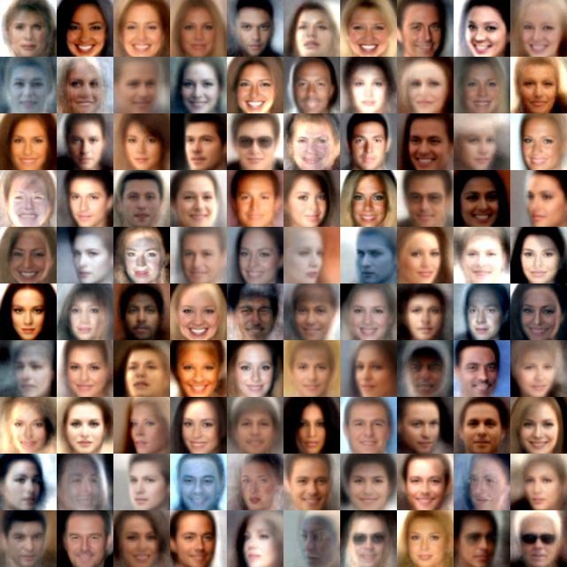
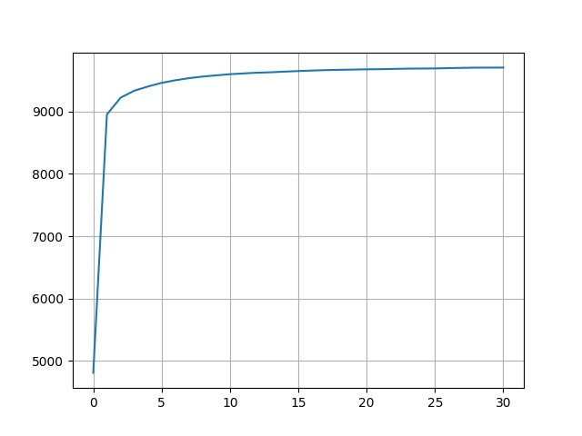
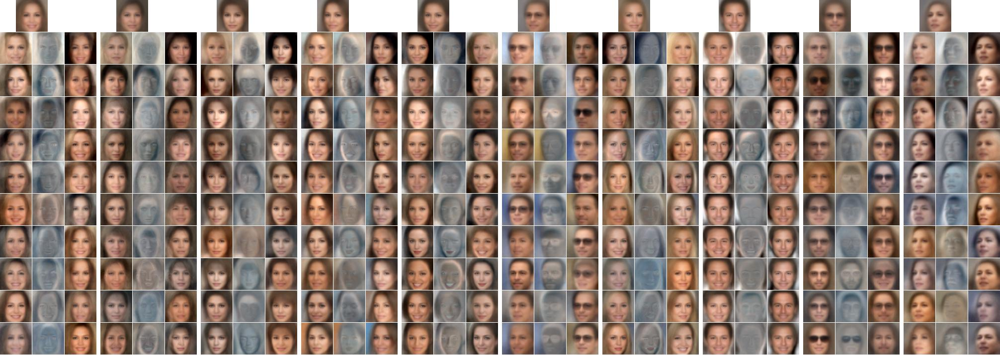
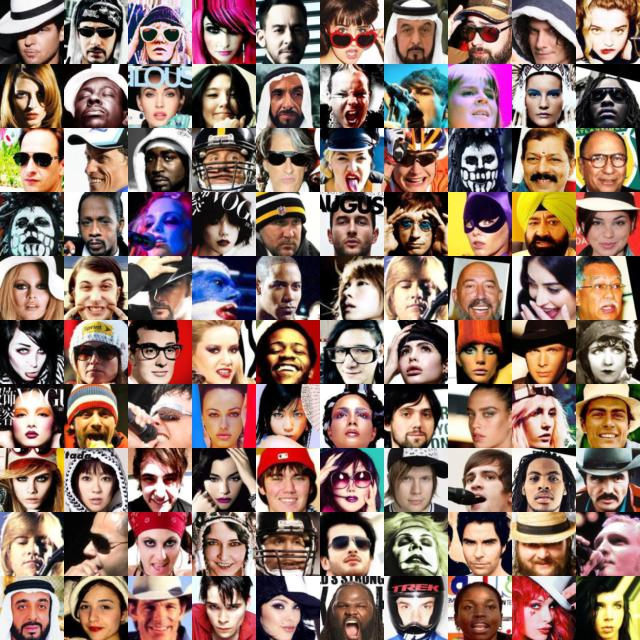
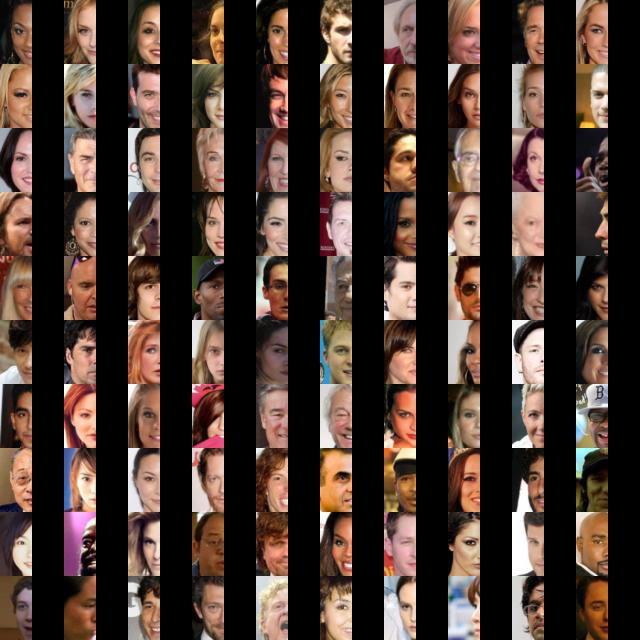
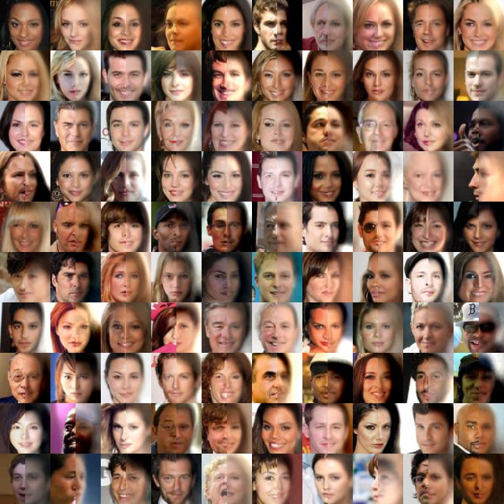

# torch-mfa
A pytorch library for fast training and inference of low-rank-plus-diagonal high-dimensional Gaussians Mixture Models.

This is a pytorch implementation based on the NeurIPS 2018 paper [On GANs and GMMs](https://arxiv.org/abs/1805.12462) by Eitan Richardson and Yair Weiss. The official TensorFlow code for reprodicing the paper results is [here](https://github.com/eitanrich/gans-n-gmms). This repository contains a faster (and cleaner) implementation of the MFA/MPPCA model with EM training.

#### Changes from the official TensorFlow repository:
- Main training method is EM instead of SGD
- Currently, only MPPCA (not MFA) is supported. There is limited support for MFA via SGD (after MPPCA EM training).
- The NDB evaluation method is not implemented yet

### Why use MFA and MPPCA?
GANs are a popular example for deep generative models that can model high-dimensional data (e.g. images) and generate very realistic new samples. However, such models have some disadvantages: adversarial training is not very stable, we don't know "what goes on inside them", it is not clear if they properly model the entire data distribution and they are not that good for different inference task, such as evaluating the likelihood of new samples and performing reconstruction.

Gaussian Mixture Models (GMMs), on the other hand, are classic parametric models that have tractable expressions for likelihood evaluation and for different inference tasks.

**Can we model images with GMMs?**

In general, a multivariate Gaussian (each component in the GMM) models pairwise correlations between the different data dimensions. If the dimension of the data samples is *d*, the covariance matrix size will be *d* by *d*, making it impractical to store and invert for high-dimensional data such as images (where *d* = height * width * channels).

Because of this limitation, many models fall back to isotropic covariance (a single global variance value) or diagonal covariance (variance per pixel). Such models are very easy to train but are not expressive enough.

A powerful yet efficient solution is constraining each covariance matrix to be "low rank plus diagonal", essentially a full-covariance on some low-dimensional learned subspace of the data domain.

Two low-rank-plus-diagonal GMM variances:
- **MFA**: Mixture of Factor Analyzers is the more general model.
- **MPPCA**: In Mixture of Probabilistic PCA, the "noise" is isotropic i.e. all added diagonal elements in the covariance are the same.

Additional reading:
- [On GANs and GMMs paper](https://arxiv.org/abs/1805.12462)
- [Factor Analysis on Wikipedia](https://en.wikipedia.org/wiki/Factor_analysis)
- [MPPCA paper](http://www.miketipping.com/papers/met-mppca.pdf)
- [MFA paper](https://www.csie.ntu.edu.tw/~mhyang/course/u0030/papers/Mixture%20of%20Factor%20Analyzers.pdf)

### TODO:
- [x] K-means initialization option
- [ ] Implement EM training for diagonal noise covariance (MFA) - currently only supported by SGD (less stable)
- [ ] Improve stability of SGD training
- [ ] Add NDB evaluation

### Prerequisites

- Python 3.x, pytorch >= 1.2.0

### Code structure

`mfa.py` is a pytorch Module implementing the MFA/MPPCA model as well as training and inference code.

## Training

`train.py` is an example script that fits a MPPCA model for CelebA and for MNIST.

Random samples generated from a MPPCA model trained on CelebA:

The test log-likelihood during training iterations:

The first 10 learned components:

## Inference

`inference.py` is an example script for two inference tasks - likelihood evaluation and image reconstruction.

Found outliers (strange-looking celebs...):

In-painting (right-half of each face is reconstructed from the observed left half):

## Citation
<pre>@inproceedings{richardson2018gans,
  title={On gans and gmms},
  author={Richardson, Eitan and Weiss, Yair},
  booktitle={Advances in Neural Information Processing Systems},
  pages={5847--5858},
  year={2018}
}</pre>
